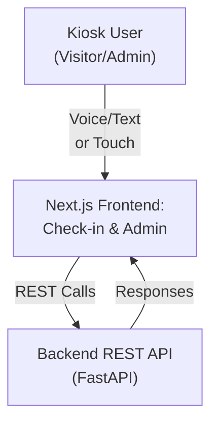
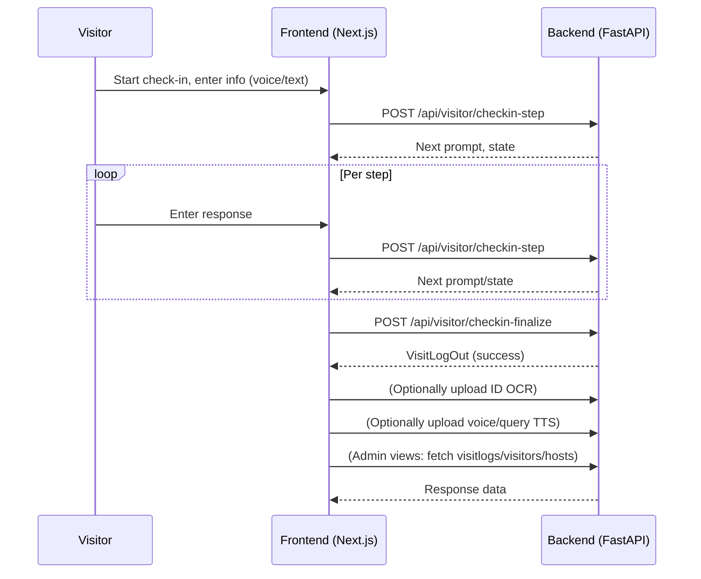

# Visitor Management Frontend (Next.js)

This frontend is a modern, self-service kiosk interface for visitor check-in and admin management, built with Next.js for the web or touchscreen devices. It guides visitors through a multi-step check-in process using voice or text, ID scanning via OCR, and provides an admin dashboard to manage logs. All user flows communicate with the visitor_management_backend via RESTful APIs.

---

## Table of Contents

- [Architecture Overview](#architecture-overview)
- [Kiosk UI and Admin Flows](#kiosk-ui-and-admin-flows)
- [Setup & Running Locally](#setup--running-locally)
- [API Integration & Example Workflow](#api-integration--example-workflow)
- [Customization & Theming](#customization--theming)
- [Development, Build & Deploy](#development-build--deploy)

---

## Architecture Overview

- **Platform:** Next.js 15+ (App Router paradigm)
- **UI Paradigm:** Step-by-step conversational form, with support for both touch and voice.
- **Features:** Visitor Check-In, Admin Dashboard, Real-time validation, ID OCR upload, Speech-to-text and text-to-speech integration.

### High-level Component Diagram



**Main Pages:**
- `/` - Welcome and initial step of check-in
- `/checkin` - Step-by-step visitor data entry, voice/text input
- `/admin` - Dashboard: visitors, hosts, logs

---

## Kiosk UI and Admin Flows

### Visitor Flow

1. **Start Check-In**  
   Visitor begins at `/` or `/checkin`, chooses text or voice input.

2. **Conversational Data Entry**  
   Each response is submitted to `/api/visitor/checkin-step`; the prompt and required field update for the next answer.

3. **ID Scan (OCR)**  
   User is prompted to scan/upload ID for OCR. Image is POSTed to `/api/ocr/upload-id` (from frontend).

4. **Finalize Check-In**  
   All collected data is sent to `/api/visitor/checkin-finalize`.

5. **Completion and Host Notification**  
   Success page shown; backend triggers notification to the relevant host.

### Admin Flow

- Navigate to `/admin` to view recent visits, visitors, or hosts.
- Filter/log views are fetched from the backend (`/api/admin/visitlogs`, `/api/admin/visitors`, etc).

---

## Setup & Running Locally

### 1. Requirements

- Node.js 18+
- Backend API available locally (default: `http://localhost:8000`)

### 2. Install dependencies

```bash
npm install
```

### 3. Run in development

```bash
npm run dev
```

Visit [http://localhost:3000](http://localhost:3000) in your browser or kiosk device.

### 4. Environment Variables

- Configure the backend API endpoint if different from default (use `.env.local`):

```
NEXT_PUBLIC_API_BASE_URL=http://localhost:8000
```

---

## API Integration & Example Workflow

- All form/page actions submit to the backend API endpoints.
- Use fetch/axios or built-in Next.js methods to POST visitor answers, OCR files, audio, etc.
- Example: Check-in step payload

```js
fetch(`${apiBaseUrl}/api/visitor/checkin-step`, {
  method: "POST",
  headers: { "Content-Type": "application/json" },
  body: JSON.stringify({
    conversation_state: {},
    user_input: "Alice Smith",
    input_mode: "voice"
  })
});
```

- Example: OCR upload

```js
const formData = new FormData();
formData.append("file", file);
fetch(`${apiBaseUrl}/api/ocr/upload-id`, { method: "POST", body: formData });
```

- Admin dashboard fetches records using:

```js
fetch(`${apiBaseUrl}/api/admin/visitlogs?skip=0&limit=25`)
```

---

## Customization & Theming

- **Primary Color:** `#1976D2`
- **Secondary Color:** `#424242`
- **Accent:** `#FFB300`
- **Theme:** Light/Modern Minimal

Edit styles or override in `src/app/globals.css` and component-level CSS.

### Layout Description
- Kiosk-focused, with welcoming home, large touch targets, step navigation, real-time feedback.
- Microphone button and keyboard input selection.
- Clear navigation for both Visitors and Admins.

---

## Development, Build & Deploy

- **Local Build:** `npm run build`
- **Start Production:** `npm start`
- **Lint:** `npm run lint`
- **Deploy:** Use Vercel, Docker, or your cloud of choice.

**Produces static output for kiosk screens**, can run on any touchscreen PC or tablet.

---

## Example Workflow Diagram



---

## Learn More

- [Next.js Documentation](https://nextjs.org/docs)
- [FastAPI Backend Docs (running at /docs locally)](http://localhost:8000/docs)
- Ask dev team or check `/api/` folder for more UI integration examples.

